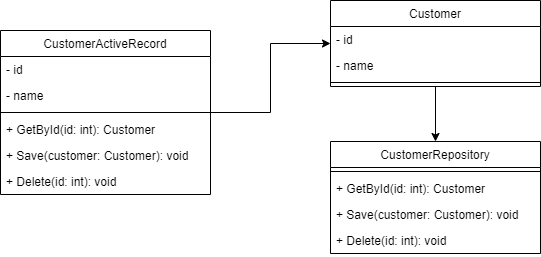

[//]: # (Draft)

###### TODOs

- [ ] Finish writing the document

# Domain Driven Design in Django

---

## Table of Contents

- [Introduction](#introduction)
  - [What is Domain Driven Design?](#what-is-domain-driven-design)
  - [Why use Domain Driven Design?](#why-use-domain-driven-design)
  - [What is a domain model?](#what-is-a-domain-model)
  - [Why use a domain model?](#why-use-a-domain-model)
  - [Why use a domain service?](#why-use-a-domain-service)
- [Designing a Domain Model](#designing-a-domain-model)
  - [Bounded Contexts](#bounded-contexts)
  - [Ubiquitous Language](#ubiquitous-language)
  - [Collaborating Objects](#collaborating-objects)

---

## Introduction

### What is Domain Driven Design?

Domain Driven Design (DDD) is a software design approach that focuses on the core domain and domain logic of the
application. It provides a way of thinking about the problem you are trying to solve and how to solve it, based on the
principles of object-oriented programming.

DDD is not a set of rules that you must follow. Instead, it is a way of thinking about your application that emphasizes
understanding the business domain and building software that reflects that understanding. By focusing on the core domain
and domain logic, DDD allows you to design software that is easy to understand, maintain, and evolve as the business
needs change.

### Why use Domain Driven Design?

There are many benefits to using DDD. For example, DDD allows you to:

- Build software that reflects the business domain and is easier to understand
- Collaborate more effectively with domain experts and other stakeholders
- Identify and manage complexity more effectively
- Build software that can evolve as the business needs change

### What is a domain model?

A domain model is a way of representing the entities and relationships that exist in a particular domain. A domain is
simply a subject area, such as "books", "customers", or "employees". A domain model is a model of the entities and
relationships that exist in that domain.

For example, a domain model for a "book store" application might include entities such as "book", "author", "customer",
and "order", and relationships such as "author of", "customer of", and "ordered by". The domain model provides a shared
understanding of the business domain among stakeholders, including domain experts, business analysts, and developers.

### Why use a domain model?

A domain model provides several benefits, such as:

- Provides a shared understanding of the business domain among stakeholders
- Allows you to visualize the domain and understand the relationships between entities
- Helps to identify and manage complexity
- Can be used to communicate the domain to other people, such as business analysts, product managers, and other
  developers

### Why use a domain service?

A domain service is a class that performs a specific operation that is necessary for the domain, but that doesn't
belong to any particular entity. For example, if you have an application that manages a library, you might have a
domain service called "LibraryService" that includes methods for checking out books and returning books. These methods
would not belong to any particular entity, such as "Book" or "Customer", because they involve multiple entities.

## Designing a Domain Model

### Bounded Contexts

A bounded context is a boundary that separates a part of a system from the rest of the system. It is a way of
organizing a system into smaller parts that are easier to understand and maintain, and that can evolve independently
of the rest of the system.

### Ubiquitous Language

A ubiquitous language is a common language that is used by all the people involved in a project. It is a language that
is shared by business analysts, product managers, developers, and users, and that is used to communicate about the
domain model and the requirements of the application.

### Collaborating Objects

Collaborating objects are objects that work together to perform a task. They are objects that are related to each
other in some way, such as "book" and "author", or "customer" and "order".

## Implementing a Domain Model

### Repository Pattern

The repository pattern is a design pattern that's used in object-oriented programming to encapsulate the logic for
accessing data from a data source. The idea is to create a class that provides a consistent interface to a data
source, such as a database, and that hides the implementation details of the data source from the rest of the
application.

If you have a database table that stores information about customers, you might create a class called "
CustomerRepository"
that provides a consistent interface to that table. Each method in the repository class would correspond to a particular
operation, such as "get all customers", "get customer by ID", or "add customer".

The name "repository" specifically refers to the way that this pattern is implemented in the Java Persistence API
(JPA), which is a popular tool for accessing databases from Java applications. However, the underlying concept of
encapsulating data access is used in many other programming languages and frameworks as well.

###### Example

Let's say you have a database table called "books" that contains information about books, such as the title, author, and
publication date. You might create a Python class called "BookRepository" that provides a consistent interface to that
table:

```python
import sqlite3


class BookRepository:
    def __init__(self, dbfile):
        self.dbfile = dbfile

    def get_all(self):
        with sqlite3.connect(self.dbfile) as conn:
            cursor = conn.cursor()
            cursor.execute("SELECT * FROM books")
            return cursor.fetchall()

    def get_by_id(self, id):
        with sqlite3.connect(self.dbfile) as conn:
            cursor = conn.cursor()
            cursor.execute("SELECT * FROM books WHERE id = ?", (id,))
            return cursor.fetchone()

    def add(self, book):
        with sqlite3.connect(self.dbfile) as conn:
            cursor = conn.cursor()
            cursor.execute("INSERT INTO books (title, author, publication_date) VALUES (?, ?, ?)",
                           (book.title, book.author, book.publication_date))
            conn.commit()
```

### Active Record Pattern

"Active Record" is a design pattern that's used in object-oriented programming to manage data in a database. The idea is
to represent each row of data in a database table as an object in your program, and to include in that object not just
the data itself, but also the logic that manipulates the data.

If you have a database table that stores information about customers, you might create a class called "Customer" that
maps to that table. Each instance of the Customer class would represent a row in the table, and would include methods
for reading and writing data to and from the table, as well as any additional behavior specific to customers, such as
calculating discounts or generating reports.

The name "Active Record" specifically refers to the way that this pattern is implemented in the Ruby on Rails framework,
which is a popular tool for web development. However, the underlying concept of representing database records as objects
is used in many other programming languages and frameworks as well.

###### Example

Let's say you have a database table called "books" that contains information about books, such as the title, author, and
publication date. You might create a Python class called "Book" that represents a row in that table:

```python
import sqlite3

class Book:
    def __init__(self, title, author, publication_date):
        self.title = title
        self.author = author
        self.publication_date = publication_date

    @staticmethod
    def connect():
        connection = sqlite3.connect('books.db')
        connection.execute('CREATE TABLE IF NOT EXISTS books (title TEXT, author TEXT, publication_date DATE)')
        return connection

    def save(self):
        connection = self.connect()
        cursor = connection.cursor()
        cursor.execute('INSERT INTO books (title, author, publication_date) VALUES (?, ?, ?)',
                       (self.title, self.author, self.publication_date))
        connection.commit()

    @staticmethod
    def all():
        connection = Book.connect()
        cursor = connection.cursor()
        cursor.execute('SELECT * FROM books')
        rows = cursor.fetchall()
        return [Book(*row) for row in rows]
```

This class defines three instance variables to store the title, author, and publication date of a book, as well as three
methods:

* `__init__`: the constructor for the class that sets the instance variables
* `save`: a method that inserts a new row into the "books" table with the current values of the instance variables
* `all`: a method that retrieves all rows from the "books" table and returns a list of Book instances

With this class, you can create a new Book object, set its properties, and save it to the database like this:

```python
book = Book('The Catcher in the Rye', 'J.D. Salinger', '1951-07-16')
book.save()
```

You can also retrieve all books from the database like this:

```python
books = Book.all()

for book in books:
    print(book.title)
```

This is just a simple example, but it demonstrates how you can use an Active Record pattern to represent a database
table as a class in your program, and manipulate the data with methods defined in that class.

### Repository vs. Active Record

Active Record and Repository are two different patterns that can be used for database access in an application, and they
have different goals and trade-offs.

Active Record is a pattern that combines data access and domain logic into a single object, typically a class that maps
to a row in a database table. This makes it easy to perform CRUD (Create, Read, Update, Delete) operations on database
records using familiar object-oriented syntax.



On the other hand, the Repository pattern separates the data access logic from the domain logic, typically by defining a
separate object (the Repository) that acts as a layer between the domain objects and the database. The Repository
provides an interface for interacting with the database, while the domain objects remain focused on business logic and
don't need to know about the details of database access.

In some cases, using Active Record can lead to issues with tight coupling between the domain objects and the database.
This can make it harder to maintain the code over time, especially if you need to change the underlying data access
layer.

In contrast, the Repository pattern provides a clear separation between the domain objects and the data access layer,
which can make it easier to maintain and test your code over time. However, using the Repository pattern can require
more code and abstraction layers, which can be more complex to set up and maintain.

Overall, whether to use Active Record or Repository depends on the specific needs and constraints of your application.
Both patterns have their pros and cons, and the right choice depends on factors such as the size and complexity of your
application, the amount of data access you need to perform, and the level of maintainability and testability you
require.