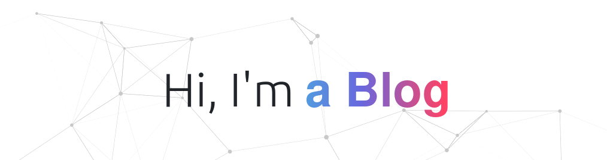

[//]: # (DDD in Django)

[//]: # (A project for the course "Advanced Software Engineering" at the DHBW Karlsruhe)

[//]: # (by Marc Gökce, 2023)


# Domain Driven Design in Django

###### Sperrvermerk

This project is a restructuring of my existing blog site (www.mkrabs.de) using Domain Driven Design principles, as
part of the Advanced Software Engineering course in the 6th semester at the Duale Hochschule of Karlsruhe. The project
code is publicly available on GitHub, but please note that I don't take any responsibility for the use of this
code / architecture or other mishaps you might write in other projects. I can't be held liable for any negative
outcomes or poor grades resulting from the use of this code, as it is intended for educational purposes only.

_Use at your own risk, lmao._

###### Table of Contents

- [Introduction](#introduction)
    - [Overview of the project](#overview-of-the-project)
    - [Description of the requirements](#description-of-the-requirements)
    - [Explanation of the approach](#explanation-of-the-approach)
- [Analysis of Ubiquitous Language](#analysis-of-ubiquitous-language)
- [Domain Model](#domain-model)
    - [Definition of the entities, value objects, and aggregates](#definition-of-the-entities-services-and-repositories)
    - [Specification of the domain services](#specification-of-the-domain-services)
    - [Implementation of the repositories](#implementation-of-the-repositories)
- [Tactical Design Patterns](#tactical-design-patterns)
    - [Implementation of Domain Events](#implementation-of-domain-events)
    - [Use of Factory and/or Builder patterns](#use-of-factory-andor-builder-patterns)
    - [Application of Specification pattern](#application-of-specification-pattern)
    - [Explanation of the approach and benefits](#explanation-of-the-approach-and-benefits)
- [Programming Principles](#programming-principles)
    - [SOLID principles](#solid-principles)
    - [GRASP principles, especially Coupling and Cohesion](#grasp-principles-especially-coupling-and-cohesion)
    - [DRY principle](#dry-principle)
    - [Explanation of the approach and benefits](#explanation-of-the-approach-and-benefits-1)
- [Implementation of Clean Architecture](#implementation-of-clean-architecture)
    - [Plan and justification of a layered architecture](#plan-and-justification-of-a-layered-architecture)
    - [Implementation of at least two layers](#implementation-of-at-least-two-layers)
    - [Explanation of the approach and benefits](#explanation-of-the-approach-and-benefits-2)
- [Refactoring](#refactoring)
    - [Identification of code smells](#identification-of-code-smells)
    - [Application of at least two refactorings](#application-of-at-least-two-refactorings)
    - [Explanation of the approach and benefits](#explanation-of-the-approach-and-benefits-3)
- [Implementation of at least one Design Pattern](#implementation-of-at-least-one-design-pattern)
    - [Justification of the pattern used](#justification-of-the-pattern-used)
    - [Creation of UML diagrams before and after the pattern implementation](#creation-of-uml-diagrams-before-and-after-the-pattern-implementation)
- [Persistence Layer](#persistence-layer)
    - [Implementation of the persistence layer](#implementation-of-the-persistence-layer)
    - [Explanation of the approach and benefits](#explanation-of-the-approach-and-benefits-4)
- [Unit Testing](#unit-testing)
    - [Unit tests](#unit-tests)
    - [Integration tests](#integration-tests)
    - [Smoke tests](#smoke-tests)
    - [Use of mocks in testing](#use-of-mocks-in-testing)
    - [Adherence to ATRIP rules](#adherence-to-atrip-rules)
    - [Explanation of the approach and benefits](#explanation-of-the-approach-and-benefits-5)
- [Conclusion](#conclusion)
    - [Summary of the work done](#summary-of-the-work-done)
    - [Review of the benefits of using DDD principles](#review-of-the-benefits-of-using-ddd-principles)
    - [Future work and improvements](#future-work-and-improvements)
- [References](#references)


# Introduction

###### Chapter 1

## Overview of the project

<div style="text-align:center">
  
</div>

This paper is about restructuring an existing Django-based blog platform using Domain-Driven Design (DDD) principles for
the Advanced Software Engineering course at the Duale Hochschule Baden-Württemberg Karlsruhe. The project aims to
implement a blog platform that allows users to create and share their personal blogs, interact with other blogs, and
express their feelings through comments and reactions.

The goal of this project is to improve the overall architecture and design of the platform by incorporating DDD
principles and best practices in software engineering. This paper serves as a documentation of the process and decisions
made during the restructuring of the project.

## Description of the requirements

The main requirement for this project is to implement DDD principles and patterns in the existing blog platform. This
includes analyzing the ubiquitous language of the domain, using tactical DDD patterns such as Value Objects, Entities,
Aggregates, Repositories, and Domain Services, and implementing a clear and meaningful domain model.

Additionally, the project must adhere to programming principles such as SOLID, GRASP, and DRY. At least one design
pattern must be implemented and justified using UML diagrams. The project must also follow the Clean Architecture
principles, with a planned and justified layer architecture, and at least two layers implemented.

To ensure code quality, at least 10 unit tests must be implemented following the ATRIP rules and using mocks where
necessary. Code smells must be identified and at least two refactorings must be applied and justified.

## Explanation of the approach

To incorporate common python DDD principles whilst following Django design principles, the first step is to
analyze the ubiquitous language of the domain and define the domain model using Value Objects, Entities, Aggregates,
Repositories, and Domain Services. This helps to ensure a clear and consistent understanding of the domain and its
concepts.

Next, the Clean Architecture principles will be followed to define a clear and meaningful layer architecture. This will
help to decouple the domain logic from the infrastructure and ensure that the application is easily testable,
maintainable, and scalable.

Programming principles such as SOLID, GRASP, and DRY will be followed to ensure code quality and maintainability. Design
patterns will be used where necessary to solve common design problems and improve the overall architecture of the
platform.

Finally, unit tests will be implemented to ensure that the code behaves as expected and to catch any potential
regressions. Code smells will be identified and refactored using appropriate techniques to ensure a clean and
maintainable codebase.

To demonstrate each refactoring step or change, we will use examples from the code base at commit hash
[#`5f0837`](https://github.com/MKrabs/Blog/tree/5f0837dd26a84c0e7e2687a66cbd54fd4254c209), which represents the code
as it existed before the start of this project.

###### Back to top [▲](#domain-driven-design-in-django)


# Analysis of Ubiquitous Language

###### Chapter 2

- [x] Überlegen wie domaine aussieht
- [ ] was macht diese aus.
- [x] was sind die wichtigsten Begriffe
- [x] was sind die wichtigsten Konzepte

## Domain Terms

The Analysis of Ubiquitous Language is a crucial step in the development of any software system, as it helps to
establish a common language and understanding between the development team and the stakeholders. This chapter will focus
on defining the domain terms, identifying the domain concepts, and creating a glossary to ensure that everyone involved
in the project has a clear understanding of the terminology used.

The first step in analyzing the ubiquitous language is to define the domain terms used in the project. These terms
should be identified from the project requirements and any other relevant documentation. In the case of our blog site
project, some of the domain terms we might identify include:


##### Blog Post

The blog post is the main concept of the project. It refers to the content created by users on the website, including
written text, images, and other media. Users can create blog posts to share their personal thoughts, documented
projects, or any other topic they wish to express in words or images. Blog posts can be read by any visitor to the site,
and users can interact with blog posts by commenting, liking, and reporting.

##### User

Users are individuals who've registered for an account on the blog site. They can create blog posts, comment on other
users' blog posts, like blog posts, and interact with other users on the platform. Users can also create a user profile
that contains personal information, including their name, profile picture, and bio. The user profile allows other users
to learn more about the user and their interests.

##### User Profile (or Portfolio)

User profiles, also referred to as portfolios, are collections of personal information and preferences that allow other
users to learn more about a particular user. The user profile contains personal information, including the user's name,
profile picture, and bio. It also contains personal tags that show the user's interests or link to other websites.

##### Comment

Comments are a feature of the blog site that allows users to provide feedback on blog posts. Users can leave comments on
blog posts written by other users, or on their own blog posts. Comments can be used to ask questions, provide feedback,
or engage in discussions with other users. Comments can be liked by other users, indicating agreement or support.

##### Tag

Tags are keywords or phrases that users can use to categorize their blog posts. Tags allow users to easily search for
content related to a particular topic. Users can add tags to their blog posts, and the tags will be displayed on the
post, making it easy for other users to find related content.

##### Heart (Like)

The heart, also referred to as a like, is a feature of the blog site that allows users to express their approval or
appreciation for a particular blog post or comment. Users can click the heart icon to like a blog post or comment,
indicating agreement or support.

##### Report

The report is a feature of the blog site that allows users to report offensive or inappropriate content. Users can
report a blog post or comment if they believe it violates the website's terms of use. The report allows the website
administrators to review the content and take appropriate action to ensure the safety and integrity of the platform.

###### Back to top [▲](#domain-driven-design-in-django)


# Domain Model

###### Chapter 3

Beispiele aus Code zeigen

## Definition of the entities, repositories and services

Currently, all of our entities, repositories, and services are defined in the `models.py` file. This is not ideal, as it
makes it difficult to identify the domain model and understand the relationships between the different entities. To
show you one example, we will look at how our users profile have been structured inside the `models.py` file:

```python
class Profile(models.Model):
  user = models.OneToOneField(User, on_delete=models.CASCADE)
  bio = models.TextField(max_length=500, blank=True)
  location = models.CharField(max_length=30, blank=True)
  picture = models.ImageField(blank=True, upload_to='profile_pictures')

  def save(self, new_image=False, *args, **kwargs):
    super().save()

    if new_image:
      self.user.profile.picture.delete(save=False)

      img = Image.open(self.picture.path)
      img = ImageOps.exif_transpose(img)

      h = img.height
      w = img.width

      if w > h:
        space_start = round((w - h) / 2)
        crop_area = (space_start, 0, space_start + h, h)
      else:
        space_start = round((h - w) / 2)
        crop_area = (0, space_start, w, space_start + w)

      img = img.crop(crop_area)
      img.save(self.picture.path)

  def __str__(self):
    return self.user.username


@receiver(post_save, sender=User)
def create_user_profile(sender, instance, created, **kwargs):
  if created:
    Profile.objects.create(user=instance, picture=f'profile_pictures/d{randint(1, 10)}.jpg')


@receiver(post_save, sender=User)
def save_user_profile(sender, instance, **kwargs):
  instance.profile.save()
```

As you can see there are a lot of things going on in this file, and it's not very clear what is the purpose of each
thing. This is the only code that defines the profile model, and every action related to it (creating, updating, saving,
deleting, aggregating, etc.) is manually writing anywhere in the project. There are no repositories or services defined.

One example of this is the `liked` view, which is responsible for handling the like/unlike action on a post:

```python
def liked(request, post_id):
  if request.user.is_authenticated:
    p = Post.objects.get(id=post_id)
    like = Like.objects.filter(author=request.user, post_id=p)
    if like.count() < 1:
      Like(author=request.user, post_id=p).save()
    else:
      like.delete()

  return redirect('post', post_id)
```

As you can see, the `liked` view is directly interacting with the database, which is not ideal. _**This is not an
isolated case**_ (
see [views.py #5f0837](https://github.com/MKrabs/Blog/blob/5f0837dd26a84c0e7e2687a66cbd54fd4254c209/blog/views.py)),
as there are many other places in the code where the database is directly accessed. This is a violation of the single
responsibility principle, as the view is responsible for handling the like/unlike action, but it is also responsible
for interacting with the database. This makes it difficult to understand what the view is doing, expanding the scope of
the view, and making it more difficult to test.

_Sounds bad, because it is bad._

Refactoring a codebase is not only about cleaning it up, but also about making sure it is efficient and easy to
understand. In the code provided, there is a violation of the single responsibility principle, as the liked view is
responsible for interacting with the database while also handling the like/unlike action. This code can be refactored
using the domain-driven design (DDD) approach, which makes use of the repository pattern to create a clear separation of
concerns between domain entities and data storage.

The first part of the refactoring is defining the domain model, which in this case is the Post entity. The domain model
only consists of the Post class and its attributes, which are defined in the domain/entities/post.py file. The purpose
of the domain model is to represent the data structure that the application will work with.

The next step is to define the interface for the domain repository. In this case, the IPostRepository interface is
defined in the domain/repository/post_repository.py file. The interface specifies the methods that the PostRepository
class will implement to manage the database operations for the Post entity. By abstracting the database management, it
will be easier to test and understand the codebase.

The final part of the refactoring is to implement the repositories and services in the infrastructure layer. The
implementation of the PostRepository is defined in the infrastructure/repositories/post_repository.py file. The purpose
of the repository is to handle the database operations such as creating and retrieving posts. The PostService class is
also defined in the application/post_services.py file, and it encapsulates the business logic for the Post entity, such
as retrieving the latest posts or creating a new post.

By splitting the code into these three parts, it will be easier to understand and test the codebase. The domain model
represents the data structure, the domain repository handles the database operations, and the domain services handle the
business logic. The codebase will be more modular, making it easier to add new features or refactor existing ones.

We split the class into tree parts:

### Part 1.a - Domain.entities

In this project, the domain model is the most atomic piece of business logic that defines the data structure of the
application. The main entity of the system is the Post class, which is responsible for representing the blog posts in
the database. This class is defined in the domain/entities/post.py file, and it inherits from Django's models.Model
class.

The Post entity has several attributes, including the author, which is a foreign key to the User model provided by
Django's authentication system. The title attribute is a string that represents the title of the blog post, while the
short attribute is a shorter summary of the post's content. The body attribute is a text field that holds the main
content of the post, and the date attribute represents the date and time the post was created.

```python
# domain/entities/post.py

class Post(models.Model):
  image_choice = (
    ('iFrame', 'iFrame'),
    ('image', 'image'),
    ('bi-icon', 'bi-icon'),
  )

  author = models.ForeignKey(User, on_delete=models.SET_NULL, default=None, null=True)
  title = models.CharField(max_length=200)
  image_type = models.CharField(max_length=20, choices=image_choice, default='bi-icon')
  image = models.CharField(max_length=500, default='bi-robot')
  short = models.CharField(max_length=255)
  body = models.TextField(max_length=20000)
  date = models.DateTimeField(auto_now=True)

  def __str__(self):
    return f'{self.author} - {self.title}'
```

The `__str__` method is defined to return a string representation of the object that includes the author and the title
of the post. This ensures that when a Post object is displayed in the **Django admin panel** or any other context where
string representation is needed, it will be displayed in a more readable format.

### Part 1.b - Domain.repository

The repository defines how the interface for the `post` entity access is laid out, making sure that the methods
arguments and return types are strongly specified. In other words, the repository acts as a layer of abstraction between
the entity and the data storage, allowing for a clear separation of concerns.

Here is part of the code for the `IPostRepository` interface, which specifies the contract that the implementation of
the PostRepository must adhere to. The create and save methods define the CRUD operations for creating and updating a
post, respectively. The `get_all_from_user` interface method is a custom method that should, by the name of it retrieve
all posts for a particular user and can optionally be ordered by a given field.

```python
# domain/repository/post_repository.py

class IPostRepository(ABC):

  @abstractmethod
  def create(self, sender, instance, created, **kwargs) -> Post | None:
    raise NotImplementedError

  @abstractmethod
  def get_all_from_user(self, user_id: int, order_by: str = None) -> QuerySet:
    raise NotImplementedError

  @abstractmethod
  def get_count_by_author(self, author_id: int) -> int:
    raise NotImplementedError

# [...]
```

All the methods defined here are meant to be used, which is the reason for the `NotImplementedError` exception being
present at the end of each method. These are only a few of the methods defined in the `IPostRepository`.

### Part 2 - Infrastructure.Repository

The infrastructure repository is responsible for implementing the behavior defined in the interface, making it the
lowest layer of the system that interacts with the `post` entity. This approach ensures that the repository closely
follows the business logic of the project. The infrastructure layer's repository is the lowest layer of code that should
interact with the `post` entity. Essentially, it connects the database to the application logic, via Django's ORM
(see: `Post.objects.`).

Simply said: Our `PostRepository` class defines methods that will allow the application to perform various operations on
`post` entities, such as creating new posts, updating existing posts, or retrieving posts based on certain criteria.

```python
# infrastructure/repositories/profile_repository.py

class PostRepository(IPostRepository):
  likes_repo = LikeRepository()

  @staticmethod
  @receiver(post_save, sender=Post)
  def create(sender, instance, created, **kwargs) -> Post | None:
    if created:
      return None

    return Post.objects.create(
      author=instance.author,
      title=instance.title,
      image_type=instance.image_type,
      image=instance.image,
      short=instance.short,
      body=instance.body
    )

  def get_all_from_user(self, user_id: int, order_by: str = None) -> QuerySet:
    posts = Post.objects.filter(author=user_id)

    if order_by:
      return posts.order_by(order_by)

    return posts

  # [...]
```

The `create` method is a signal receiver that is triggered whenever a new post is saved to the database.
Django signals are a way to allow decoupled applications to get notified when certain events occur. If a Post is being
created by Django's ORM, the `create` method will be called, for us, after the post creation signal is sent.
It checks if the post was just created or if it already existed. If it already existed, it returns `None`. Otherwise,
it creates a new post object with the relevant attributes from the request and returns it.

`get_all_from_user` does exactly what its name suggests: it retrieves all posts created by a specific user. It does this
by filtering the `Post` objects by the user ID. If an `order_by` argument is provided, the resulting query set will be
ordered accordingly. Otherwise, the posts will be returned in the order they were retrieved from the database.

These are just a few of the methods defined in the `PostRepository` class.

Inside the `PostRepository` class, we can see that it has a `LikeRepository` attribute. It is meant to be used solely
inside the `PostRepository` class. It is used to provide higher-level access to other related entities; in this
particular case, it is used to provide access to the `Like` entity. The `LikeRepository` is as much part of the
infrastructure layer as the `PostRepository`, which means that it provides an implementation for a specific interface
and interacts with the data storage system directly. This allows the `PostRepository` to perform more complex operations
with the `Like` entity, without having to worry about the low-level details of how the data is stored and retrieved.

Overall, the `PostRepository` class provides an implementation of the `IPostRepository` interface, allowing the
application to interact with `post` entities in a standardized way. By separating the implementation details of the
repository from the rest of the application logic, we can ensure that the code is easier to maintain and modify in the
future.

### Part 3 - The implementation of the Post-Service

The `PostService` implementation is located at the application layer and serves as an intermediary between the
presentation layer (views or api) and the lower-level data access layers. Its purpose is to aggregate multiple
lower-level accesses of the `post` entity and provide a simplified interface for the views to interact with.

The `PostService` constructor initializes instances of the `PostRepository`, `LikeRepository`, `CommentRepository`, and
`ProfileService` classes. This allows the service to access and manipulate the various aspects of a `post` entity, such
as its content, comments, likes and so on.

```python
# application/post_services.py

class PostService:
  def __init__(self):
    self.post_repo = PostRepository()
    self.likes_repo = LikeRepository()
    self.comments_repo = CommentRepository()
    self.profile_repo = ProfileService()

  def get_latest_posts(self, user: User, order_by: str = None, additional_fields: bool = False) -> QuerySet:
    posts = self.post_repo.get_all(order_by=order_by)

    if additional_fields:
      for post in posts:
        post.comments = self.comments_repo.get_count_by_post(post_id=post.id)
        post.likes = self.likes_repo.get_count_post(post_id=post.id)
        self.profile_repo.add_additional_fields(post.author)
        if user.is_authenticated:
          post.liked = self.likes_repo.did_user_like(user_id=user.id, post_id=post.id)

    return posts

  def get_post_by_id(self, post_id: int, beautify: bool = False) -> Optional[Post]:
    post = self.post_repo.get_by_id(post_id)

    if post and beautify:
      post.body = MarkdownProcessor.marker(post.body)

    return post

# [...]
```

One of the main methods of the `PostService` is `get_latest_posts`, which retrieves the latest posts from the `post`
repository and aggregates additional fields related to each post, such as the _number of comments and likes_. If the
`additional_fields` parameter is set to `True`, the method adds these fields to each post and checks if the user has
liked the post (or not). This method serves as an example of how the `PostService` can perform complex operations that
involve multiple aspects of the `post` entity and provide a simplified interface for the `views` or `APIs` to consume.

## Presentation Layer

The presentation layer is the topmost layer in our architecture. The views layer is a part of the presentation layer and
is responsible for rendering HTML pages that are returned to the user's browser. The URLs are mapped to views in the
`views/urls.py` file, which is responsible for handling different URLs. Each view is responsible for handling a specific
request and returning a response.

```python
# blog/presentation/views/urls.py

urlpatterns = [
  path('', HomepageView.index, name='home'),
  path('<int:page>/', HomepageView.index),

  path('post/<int:post_id>/', PostView.post, name='post'),
  path('post/<int:post_id>/<int:page>/', PostView.post),
  # ...
]
```

The presentation layer also includes the API layer. The API layer is structured the same as the views layer and follows
the same important patterns. Similar to the views layer, the API layer also has a `urls.py` file with multiple services:

```python
# blog/presentation/api/urls.py

urlpatterns = [
    path('index/', PostAPI.get_latest_posts),
    path('post/<int:post_id>/', PostAPI.get_post),

    path('@<str:user_name>/', ProfileAPI.get_user_profile),
]
```

Both the views and API layers are responsible for handling requests and returning responses. Looking at the `urls.py`, 
we can see for example that the path `post/<int:post_id>/` is mapped to the `PostView.post` method. This means that 
when a user visits the `/post/1/` URL, the `PostView.post` method will be called and the user will be presented with
the html page representing the post with the id of 1. The `PostView.post` method is responsible for retrieving the post
with the `id` of `1` from the services, processing the data, and returning a response.

In the `PostView` class, we see an example of a view. This view is responsible for handling a specific URL and returning
a response. It uses the `PostService`, `CommentService`, and `ProfileService` to retrieve the necessary data from the
repository layer and processes the data to create a response. The `post` method in the `PostView` class is responsible
for rendering a specific post with its comments and additional information. Here is the implementation of the `post`
method:

```python
# blog/presentation/views/post_view.py

class PostView:
  post_service = PostService()
  comment_service = CommentService()
  profile_service = ProfileService()

  @classmethod
  def post(cls, request, post_id, page=1, beautify=True):
    blog_post = cls.post_service.get_post_by_id(post_id=post_id, beautify=beautify)
    cls.post_service.add_additional_fields(entity=blog_post)

    comments = cls.comment_service.get_comments_by_post_id(post_id=post_id, beautify=beautify)
    p, num_pages = CommentService.paginate_posts(comments, param=5, page=page)
    comments = p.object_list

    context = {
      'post': blog_post,
      'comments': comments,
      'page': {
        'current': p.number,
        'total': num_pages,
      },
    }

    return render(request, 'blog/post.html', context)
```

Overall, the presentation layer provides the user-facing interface for the application. The views and API are
responsible for processing requests, retrieving data, and creating responses. The URLs are used to map the requests to
the appropriate views or API services, allowing for a clear separation of concerns within the application.

###### Back to top [▲](#domain-driven-design-in-django)

# Tactical Design Patterns

###### Chapter 4

## Implementation of Domain Events

## Use of Factory and/or Builder patterns

## Application of Specification pattern

## Explanation of the approach and benefits

###### Back to top [▲](#domain-driven-design-in-django)


# Programming Principles

###### Chapter 5

## SOLID principles

## GRASP principles, especially Coupling and Cohesion

## DRY principle

Can you see the difference between these two code blocks?
```python
if p.author:
    p.author.profile.bio = marker(p.author.profile.bio)
    p.author.total_posts = Post.objects.filter(author=p.author).count()
    p.author.total_comments = Comment.objects.filter(author=p.author).count()
    p.author.total_likes = Like.objects.filter(author=p.author).count()
```

```python
if c.author:
    c.author.profile.bio = marker(c.author.profile.bio)
    c.author.total_posts = Post.objects.filter(author=c.author).count()
    c.author.total_comments = Comment.objects.filter(author=c.author).count()
    c.author.total_likes = Like.objects.filter(author=c.author).count()
```

This is not what good code smells like. To fix this, we will:
- rethink the way we retrieve likes
  - For this, the likes per user will be lazyly aggregated and counted whenever an event is fired.
- implement a method in the repository class to retrieve these infos called `add` and using `overload` from the typing 
  module

## Explanation of the approach and benefits

###### Back to top [▲](#domain-driven-design-in-django)


# Implementation of Clean Architecture

###### Chapter 6

## Plan and justification of a layered architecture

## Implementation of at least two layers

## Explanation of the approach and benefits

###### Back to top [▲](#domain-driven-design-in-django)


# Refactoring

###### Chapter 7

## Identification of code smells

## Application of at least two refactorings

## Explanation of the approach and benefits

###### Back to top [▲](#domain-driven-design-in-django)


# Implementation of at least one Design Pattern

###### Chapter 8

## Justification of the pattern used

## Creation of UML diagrams before and after the pattern implementation

###### Back to top [▲](#domain-driven-design-in-django)


# Persistence Layer

###### Chapter 9

## Implementation of the persistence layer

### Repository pattern

### Active record pattern

## Explanation of the approach and benefits

###### Back to top [▲](#domain-driven-design-in-django)


# Unit Testing

###### Chapter 10

## Unit tests

## Integration tests

## Smoke tests

## Use of mocks in testing

## Adherence to ATRIP rules

- Automatic
- Thorough (Vollständig)
- Repeatable
- Independent
- Professional

## Explanation of the approach and benefits

###### Back to top [▲](#domain-driven-design-in-django)


# Conclusion

###### and or summary

## Summary of the work done

## Review of the benefits of using DDD principles

## Future work and improvements

###### Back to top [▲](#domain-driven-design-in-django)


# References

###### Written references used in the project

* https://docs.djangoproject.com/en/4.2/misc/design-philosophies/#models
* https://www.cosmicpython.com/book/preface (very nice)
* https://www.cosmicpython.com/book/chapter_02_repository.html
* https://wiki.c2.com/?CouplingAndCohesion
* https://iktakahiro.dev/python-ddd-onion-architecture
* https://www.amazon.com/Domain-Driven-Design-Tackling-Complexity-Software/dp/0321125215
* https://github.com/jdiazromeral/django-ddd
* https://openbase.com/python/Django-ddd
* https://michalgodkowicz.medium.com/another-way-to-persist-ddd-aggregates-in-django-d148f4cad298
* https://www.apress.com/gp/blog/all-blog-posts/domain-driven-design-with-django/16172586
* https://thedomaindrivendesign.io/why-use-domain-driven-design/
* https://chat.openai.com
* https://douwevandermeij.medium.com/hexagonal-architecture-in-python-7468c2606b63
* https://io.made.com/repository-and-unit-of-work-pattern-in-python
* https://codingcanvas.com/hexagonal-architecture/
* https://www.reddit.com/r/Python/comments/9wbk8k/repository_pattern_with_sqlalchemy/

###### Video References

* https://www.youtube.com/watch?v=QVTWvOzktbE
* https://www.youtube.com/watch?v=hv-LiKQgN90
* https://www.youtube.com/watch?v=Ru2T4fu3bGQ

###### Back to top [▲](#domain-driven-design-in-django)


_Thank you for reading._

[@MKrabs](https://www.github.com/MKrabs) - [Website](https://www.mkrabs.de)

[//]: # (Styles)
<style>

ol { list-style-type: upper-roman; }
ol ol { list-style-type: decimal; }

</style>
