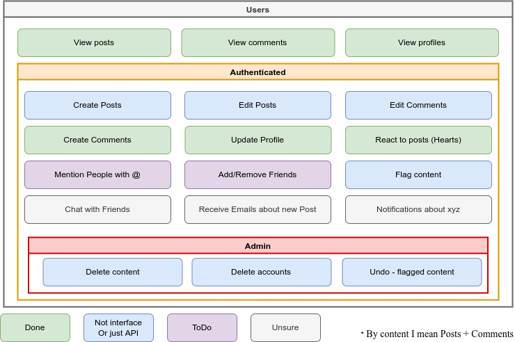
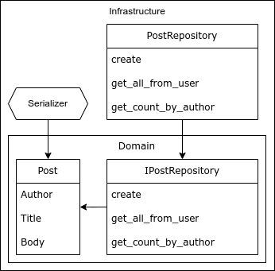

[//]: # (DDD in Django)

[//]: # (A project for the course "Advanced Software Engineering" at the DHBW Karlsruhe)

[//]: # (by Marc Gökce, 2023)


# Domain Driven Design in Django

###### Sperrvermerk

> This project is a restructuring of my existing blog site (www.mkrabs.de) using Domain Driven Design principles, as
> part of the Advanced Software Engineering course in the 6th semester at the Duale Hochschule of Karlsruhe. The project
> code is publicly available on GitHub, but please note that I don't take any responsibility for the use of this
> code / architecture or other mishaps you might write in other projects. I am not liable for any negative
> outcomes or poor grades resulting from the use of this code, as it's intended for educational purposes only. Everything
> is given **as is**.
>
> _Use at your own risk, lmao._

###### Table of Contents

1. [Introduction](#introduction)
   1. Overview of the Project 
   2. Description of the requirements 
2. [Domain Driven Design](#domain-driven-design)
   1. Domain Terms
   2. Use Cases Diagrams
   3. Explanation of the approach
3. [Clean Architecture](#clean-architecture)
   1. Definition of the entities, repositories and services
   2. Refactoring the Codebase
4. [Programming Principles](#programming-principles)
   1. SOLID Principles
   2. GRASP principles, especially Coupling and Cohesion
   3. DRY principle
5. [Persistence Layer](#persistence-layer)
   1. Implementation of the persistence layer
   2. Explanation of the approach and benefits
6. [Design Patterns](#design-patterns)
   1. Implementation of the design patterns
   2. Explanation of the approach and benefits
7. [Testing](#testing)
   1. Manually testing
   2. Unit tests
   3. Integration tests
   4. Smoke tests
   5. Use of mocks in testing
   6. Adherence to ATRIP rules
   7. Explanation of the approach and benefits
8. [Conclusion](#conclusion)
   1. Summary of the work done
   2. Review of the benefits of using DDD principles
   3. Future work and improvements
9. [References](#references)

---

# Introduction

###### Chapter 1

## Overview of the Project

<div style="text-align:center">
  
</div>

This paper is about restructuring an existing Django-based blog platform using Domain-Driven Design (DDD) principles for
the Advanced Software Engineering course at the Duale Hochschule Baden-Württemberg Karlsruhe. The project aims to
implement a blog platform that allows users to create and share their personal blogs, interact with other blogs, and
express their feelings through comments and reactions.

The goal of this project is to improve the overall architecture and design of the platform by incorporating DDD
principles and best practices in software engineering. This paper serves as a documentation of the process and decisions
made during the restructuring of the project.

## Description of the requirements

The main requirement for this project is to implement DDD principles and patterns in the existing blog platform. This
includes analyzing the ubiquitous language of the domain, using tactical DDD patterns such as Value Objects, Entities,
Aggregates, Repositories, and Domain Services, and implementing a clear and meaningful domain model.

Additionally, the project must adhere to programming principles such as SOLID, GRASP, and DRY. At least one design
pattern must be implemented and justified using UML diagrams. The project must also follow the Clean Architecture
principles, with a planned and justified layer architecture, and at least two layers implemented.

To ensure code quality, at least 10 unit tests must be implemented following the ATRIP rules and using mocks where
necessary. Code smells must be identified and at least two refactorings must be applied and justified.


###### Back to top [▲](#sperrvermerk)

# Domain Driven Design

###### Chapter 2

## Analysis of Ubiquitous Language - Domain Terms

The Analysis of Ubiquitous Language is a crucial step in the development of any software system, as it helps to
establish a common language and understanding between the development team and the stakeholders. This chapter will focus
on defining the domain terms, identifying the domain concepts, and creating a glossary to ensure that everyone involved
in the project has a clear understanding of the terminology used.

The first step in analyzing the ubiquitous language is to define the domain terms used in the project. These terms
should be identified from the project requirements and any other relevant documentation. In the case of our blog site
project, some of the domain terms we might identify include:


##### Blog Post

The blog post is the main concept of the project. It refers to the content created by users on the website, including
written text, images, and other media. Users can create blog posts to share their personal thoughts, documented
projects, or any other topic they wish to express in words or images. Blog posts can be read by any visitor to the site,
and users can interact with blog posts by commenting, liking, and reporting.

##### User

Users are individuals who've registered for an account on the blog site. They can create blog posts, comment on other
users' blog posts, like blog posts, and interact with other users on the platform. Users can also create a user profile
that contains personal information, including their name, profile picture, and bio. The user profile allows other users
to learn more about the user and their interests.

##### User Profile (or Portfolio)

User profiles, also referred to as portfolios, are collections of personal information and preferences that allow other
users to learn more about a particular user. The user profile contains personal information, including the user's name,
profile picture, and bio. It also contains personal tags that show the user's interests or link to other websites.

##### Comment

Comments are a feature of the blog site that allows users to provide feedback on blog posts. Users can leave comments on
blog posts written by other users, or on their own blog posts. Comments can be used to ask questions, provide feedback,
or engage in discussions with other users. Comments can be liked by other users, indicating agreement or support.

##### Tag

Tags are keywords or phrases that users can use to categorize their blog posts. Tags allow users to easily search for
content related to a particular topic. Users can add tags to their blog posts, and the tags will be displayed on the
post, making it easy for other users to find related content.

##### Heart (Like)

The heart, also referred to as a like, is a feature of the blog site that allows users to express their approval or
appreciation for a particular blog post or comment. Users can click the heart icon to like a blog post or comment,
indicating agreement or support.

##### Report

The report is a feature of the blog site that allows users to report offensive or inappropriate content. Users can
report a blog post or comment if they believe it violates the website's terms of use. The report allows the website
administrators to review the content and take appropriate action to ensure the safety and integrity of the platform.


## Use Cases Diagrams

| New UseCase diagram                                                 | New UseCase diagram                                                    |
|---------------------------------------------------------------------|------------------------------------------------------------------------|
|  |  |

As you can see from the two version, not much has changed functionality wise. I just changed the layout of the Usecase
diagram and added some colours. The project structure and the code complexity were the major factors we focused on
refining and improving.   


## Explanation of the approach

To incorporate common python DDD principles whilst following Django design principles, the first step is to
analyze the ubiquitous language of the domain and define the domain model using Value Objects, Entities, Aggregates,
Repositories, and Domain Services. This helps to ensure a clear and consistent understanding of the domain and its
concepts.

Next, the Clean Architecture principles will be followed to define a clear and meaningful layer architecture. This will
help to decouple the domain logic from the infrastructure and ensure that the application is easily testable,
maintainable, and scalable.

Programming principles such as SOLID, GRASP, and DRY will be followed to ensure code quality and maintainability. Design
patterns will be used where necessary to solve common design problems and improve the overall architecture of the
platform.

Finally, unit tests will be implemented to ensure that the code behaves as expected and to catch any potential
regressions. Code smells will be identified and refactored using appropriate techniques to ensure a clean and
maintainable codebase.

To demonstrate each refactoring step or change, we will use examples from the code base at commit hash
[#`5f0837`](https://github.com/MKrabs/Blog/tree/5f0837dd26a84c0e7e2687a66cbd54fd4254c209), which represents the code
as it existed before the start of this project.

###### Back to top [▲](#sperrvermerk)


# Clean Architecture

###### Chapter 3

## Definition of the entities, repositories and services

Currently (commit hash
[#`5f0837`](https://github.com/MKrabs/Blog/tree/5f0837dd26a84c0e7e2687a66cbd54fd4254c209)), all of our entities,
repositories, and services are defined in the `models.py` file. This is not ideal, as it
makes it difficult to identify the domain model and understand the relationships between the different entities. To
show you one example, we will look at how our users profile have been structured inside the `models.py` file:

```python
# blog/models.py

class Profile(models.Model):
  user = models.OneToOneField(User, on_delete=models.CASCADE)
  bio = models.TextField(max_length=500, blank=True)
  location = models.CharField(max_length=30, blank=True)
  picture = models.ImageField(blank=True, upload_to='profile_pictures')

  def save(self, new_image=False, *args, **kwargs):
    super().save()

    if new_image:
      self.user.profile.picture.delete(save=False)

      img = Image.open(self.picture.path)
      img = ImageOps.exif_transpose(img)

      h = img.height
      w = img.width

      if w > h:
        space_start = round((w - h) / 2)
        crop_area = (space_start, 0, space_start + h, h)
      else:
        space_start = round((h - w) / 2)
        crop_area = (0, space_start, w, space_start + w)

      img = img.crop(crop_area)
      img.save(self.picture.path)

  def __str__(self):
    return self.user.username


@receiver(post_save, sender=User)
def create_user_profile(sender, instance, created, **kwargs):
  if created:
    Profile.objects.create(user=instance, picture=f'profile_pictures/d{randint(1, 10)}.jpg')


@receiver(post_save, sender=User)
def save_user_profile(sender, instance, **kwargs):
  instance.profile.save()
```

Furthermore, there is only one point of entry to the app, which includes ALL database access, user forms, and
aggregation of various types. This is terrible, and I really don't know why I did it like that. Here is an example of
that:


```python
# blog/views.py

def index(request, page=1):
    latest_posts = Post.objects.order_by('-date')

    for p in latest_posts:
        p.comments = Comment.objects.filter(post_id=p.id).count()
        p.likes = Like.objects.filter(post_id=p.id).count()
        p.liked = True if Like.objects.filter(post_id=p.id, author=request.user.id) else False

        if p.author:
            p.author.profile.bio = marker(p.author.profile.bio)
            p.author.total_posts = Post.objects.filter(author=p.author).count()
            p.author.total_comments = Comment.objects.filter(author=p.author).count()
            p.author.total_likes = Like.objects.filter(author=p.author).count()

    p = Paginator(latest_posts, 4)

    try:
        page_obj = p.get_page(page)
    except EmptyPage:
        page_obj = p.page(p.num_pages)

    context = {
        'page': {
            'current': page_obj.number,
            'has_next': page_obj.has_next(),
            'has_previous': page_obj.has_previous(),
            'total': p.num_pages,
        },
        'latest_posts': page_obj.object_list,
    }

    return render(request, 'blog/index.html', context)

def post(request, post_id, page=1):
    blog_post = Post.objects.get(pk=post_id)
    comments = Comment.objects.filter(post_id=post_id).order_by('-date')
  
    if blog_post.author:
        blog_post.author.total_posts = Post.objects.filter(author=blog_post.author).count()
        blog_post.author.total_comments = Comment.objects.filter(author=blog_post.author).count()
        blog_post.author.total_likes = Like.objects.filter(author=blog_post.author).count()
  
    blog_post.likes = Like.objects.filter(post_id=blog_post.id).count()
    # ...
```

In its primitive form, our project structure looked as follows:

<div style="text-align:center">
  
</div>

As you can see there are a lot of things going on in this file, and it's not very clear what is the purpose of each
thing. This is the only code that defines the profile model, and every action related to it (creating, updating, saving,
deleting, aggregating, etc.) is manually writing anywhere in the project. There are no repositories or services defined.

One example of this is the `liked` view, which is responsible for handling the like/unlike action on a post:

```python
# blog/views.py#L142

def liked(request, post_id):
  if request.user.is_authenticated:
    p = Post.objects.get(id=post_id)
    like = Like.objects.filter(author=request.user, post_id=p)
    if like.count() < 1:
      Like(author=request.user, post_id=p).save()
    else:
      like.delete()

  return redirect('post', post_id)
```

As you can see, the `liked` view is directly interacting with the database, which is not ideal. _**This is not an
isolated case**_ (
see [views.py #5f0837](https://github.com/MKrabs/Blog/blob/5f0837dd26a84c0e7e2687a66cbd54fd4254c209/blog/views.py)),
as there are many other places in the code where the database is directly accessed. This is a violation of the single
responsibility principle, as the view is responsible for handling the like/unlike action, but it is also responsible
for interacting with the database. This makes it difficult to understand what the view is doing, expanding the scope of
the view, and making it more difficult to test.

> _Sounds bad, because it is bad._

Refactoring a codebase is not only about cleaning it up, but also about making sure it is efficient and easy to
understand. In the code provided, there is a violation of the single responsibility principle, as the liked view is
responsible for interacting with the database while also handling the like/unlike action. This code can be refactored
using the domain-driven design (DDD) approach, which makes use of the repository pattern to create a clear separation of
concerns between domain entities and data storage.

###### Back to top [▲](#sperrvermerk)

## Refactoring the Codebase

One approach to enhance the refactoring process is to incorporate the repository pattern as the basis for organizing the
data access layer. The repository pattern provides an abstraction layer between the domain model and the underlying data
storage, such as a database. By adopting the repository pattern in the refactoring process, we enhance the architecture
of the application.
The domain model represents the data structure, the domain repository handles the database operations, and the domain
services encapsulate the business logic. This modular approach simplifies understanding, testing, and extending the
codebase, making it more maintainable and adaptable to future changes.

We split the class into tree parts:

### Part 1.a - Domain.entities

In this project, the domain model is the most atomic piece of business logic that defines the data structure of the
application. The main entity of the system is the Post class, which is responsible for representing the blog posts in
the database. This class is defined in the `blog/domain/entities/post.py` file, and it inherits from Django's
models.Model class.

The Post entity has several attributes, including the **author**, which is a foreign key to the User model provided by
Django's authentication system. The **title** attribute is a string that represents the title of the blog post, while
the **short** attribute is a shorter summary of the post's content. The **body** attribute is a text field that holds
the main content of the post, and the **date** attribute represents the date and time the post was created. Pretty
trivial stuff, but important to keep seperated from the rest of the project. This is what the domain entity looks like
after extracting its core attributes:

```python
# domain/entities/post.py

class Post(models.Model):
  image_choice = (
    ('iFrame', 'iFrame'),
    ('image', 'image'),
    ('bi-icon', 'bi-icon'),
  )

  author = models.ForeignKey(User, on_delete=models.SET_NULL, default=None, null=True)
  title = models.CharField(max_length=200)
  image_type = models.CharField(max_length=20, choices=image_choice, default='bi-icon')
  image = models.CharField(max_length=500, default='bi-robot')
  short = models.CharField(max_length=255)
  body = models.TextField(max_length=20000)
  date = models.DateTimeField(auto_now=True)

  def __str__(self):
    return f'{self.author} - {self.title}'
```

The `__str__` method purely for the Django Admin panel and does not contribute to any real part of the project. It's
defined to return a string representation of the object that includes the author and the title of the post. This ensures
that when a Post object is displayed in the **Django admin panel** or any other context where string representation is
needed, it will be displayed in a more readable format instead of `post (1)`.

Our Project Tree currently looks like this:

<div style="text-align:center">
  
</div>

### Part 1.b - Domain.repository

The repository defines how the interface for the `post` entity access is laid out, making sure that the methods
arguments and return types are strongly specified. In other words, the repository acts as a layer of abstraction between
the entity and the data storage, allowing for a clear separation of concerns.

Here is part of the code for the `IPostRepository` interface, which specifies the contract that the implementation of
the PostRepository must adhere to. The create and save methods define the CRUD operations for creating and updating a
post, respectively. The `get_all_from_user` interface method is a custom method that should, by the name of it retrieve
all posts for a particular user and can optionally be ordered by a given field.

```python
# domain/repository/post_repository.py

class IPostRepository(ABC):

  @abstractmethod
  def create(self, sender, instance, created, **kwargs) -> Post | None:
    raise NotImplementedError

  @abstractmethod
  def get_all_from_user(self, user_id: int, order_by: str = None) -> QuerySet:
    raise NotImplementedError

  @abstractmethod
  def get_count_by_author(self, author_id: int) -> int:
    raise NotImplementedError

# [...]
```

All the methods defined here are meant to be used, which is the reason for the `NotImplementedError` exception being
present at the end of each method. These are only a few of the most primitive and necessary methods defined in there.

Our Project Tree currently looks like this:

<div style="text-align:center">
  
</div>

### Part 2 - Infrastructure.Repository

The infrastructure repository is responsible for implementing the behavior defined in the interface, making it the
lowest layer of the system that interacts with the `post` entity. This approach ensures that the repository closely
follows the business logic of the project. The infrastructure layer's repository is the lowest layer of code that should
interact with the `post` entity. Essentially, it connects the database to the application logic, via Django's ORM
(see: `Post.objects.`).

Simply said: Our `PostRepository` class defines methods that will allow the application to perform various operations on
`post` entities, such as creating new posts, updating existing posts, or retrieving posts based on certain criteria.

```python
# infrastructure/repositories/profile_repository.py

class PostRepository(IPostRepository):
  likes_repo = LikeRepository()

  @staticmethod
  @receiver(post_save, sender=Post)
  def create(sender, instance, created, **kwargs) -> Post | None:
    if created:
      return None

    return Post.objects.create(
      author=instance.author,
      title=instance.title,
      image_type=instance.image_type,
      image=instance.image,
      short=instance.short,
      body=instance.body
    )

  def get_all_from_user(self, user_id: int, order_by: str = None) -> QuerySet:
    posts = Post.objects.filter(author=user_id)

    if order_by:
      return posts.order_by(order_by)

    return posts

  # [...]
```

The `create` method is a _signal receiver_ that is triggered whenever a new post is saved to the database.
Django signals are a way to allow decoupled applications to get notified when certain events occur. They can be
compared to the event listeners in JavaScript. If a Post is being created by Django's ORM, the `create` method will be
called, for us, after the post creation signal is sent. It checks if the post was just created or if it already existed.
If it already existed, it returns `None`. Otherwise, it creates a new post object with the relevant attributes from the
request and returns it.

Since I want to leverage Django's ORM as much as possible, I've decided to not implement the `update` method myself. The
`update` method is already implemented by Django's ORM, so there is no need to implement it again. I merely need to
access it via the `Post.objects.create` method.

`get_all_from_user` does exactly what its name suggests: it retrieves all posts created by a specific user. It does this
by filtering the `Post` objects by the user ID. If an `order_by` argument is provided, the resulting query set will be
ordered accordingly. Otherwise, the posts will be returned in the order they were retrieved from the database.

These are just a few of the methods defined in the `PostRepository` class.

Inside the `PostRepository` class, we can see that it has a `LikeRepository` attribute. It is meant to be used solely
inside the `PostRepository` class. It is used to provide higher-level access to other related entities; in this
particular case, it is used to provide access to the `Like` entity. The `LikeRepository` is as much part of the
infrastructure layer as the `PostRepository`, which means that it provides an implementation for a specific interface
and interacts with the data storage system directly. This allows the `PostRepository` to perform more complex operations
with the `Like` entity, without having to worry about the low-level details of how the data is stored and retrieved.

In addition to the `PostRepository` class and its related files, there is another set of almost hidden files that play a
crucial role in the codebase: the serialization files. These files are responsible for converting the entities, such
as `Post` and `Like`, into JSON format, allowing for further processing or transfer of data. These files can be found in
the `infrastructure/serializers` directory and contain classes or functions that define the serialization and
deserialization logic. By separating the serialization concerns into dedicated files, we ensure a clean separation of
responsibilities and maintain the flexibility to adapt the serialization process to different requirements or formats as
needed. This is the code for the `PostSerializer` class:

```python
# infrastructure/serializers/post_serializer.py

class PostSerializer:
  @classmethod
  def serialize(cls, posts: QuerySet):
    serialized_posts = []

    for post in posts:
      serialized_posts.append({
        'id': post.id,
        'author': post.author.username or None,
        'title': post.title,
        'body': post.body,
        'date': post.date.strftime('%Y-%m-%d %H:%M:%S'),
        'image': post.image,
        'image_type': post.image_type,
      })

    return serialized_posts
```

Our Project Tree currently looks like this:

<div style="text-align:center">
  
</div>

Overall, the `PostRepository` class provides an implementation of the `IPostRepository` interface, allowing the
application to interact with `post` entities in a standardized way.

### Part 3 - The implementation of the Post-Service

The `PostService` implementation is located at the application layer and serves as an intermediary between the
presentation layer (views or api) and the lower-level data access layers. Its purpose is to aggregate multiple
lower-level accesses of the `post` entity and provide a simplified interface for the views to interact with.

The `PostService` constructor initializes instances of the `PostRepository`, `LikeRepository`, `CommentRepository`, and
`ProfileService` classes. This allows the service to access and manipulate the various aspects of a `post` entity, such
as its content, comments, likes and so on.

```python
# application/post_services.py

class PostService:
  def __init__(self):
    self.post_repo = PostRepository()
    self.likes_repo = LikeRepository()
    self.comments_repo = CommentRepository()
    self.profile_repo = ProfileService()

  def get_latest_posts(self, user: User, order_by: str = None, additional_fields: bool = False) -> QuerySet:
    posts = self.post_repo.get_all(order_by=order_by)

    if additional_fields:
      for post in posts:
        post.comments = self.comments_repo.get_count_by_post(post_id=post.id)
        post.likes = self.likes_repo.get_count_post(post_id=post.id)
        self.profile_repo.add_additional_fields(post.author)
        if user.is_authenticated:
          post.liked = self.likes_repo.did_user_like(user_id=user.id, post_id=post.id)

    return posts

  def get_post_by_id(self, post_id: int, beautify: bool = False) -> Optional[Post]:
    post = self.post_repo.get_by_id(post_id)

    if post and beautify:
      post.body = MarkdownProcessor.marker(post.body)

    return post

# [...]
```

One of the main methods of the `PostService` is `get_latest_posts`, which retrieves the latest posts from the `post`
repository and aggregates additional fields related to each post, such as the _number of comments and likes_. If the
`additional_fields` parameter is set to `True`, the method adds these fields to each post and checks if the user has
liked the post (or not). This method serves as an example of how the `PostService` can perform complex operations that
involve multiple aspects of the `post` entity and provide a simplified interface for the `views` or `APIs` to consume
in the presentation layer.

The forms used in the frontend are an integral part of the application layer of the project and serve as a means to
collect and process user input. These forms are responsible for handling the updating of user information and profiles.
The `FormUpdater` class demonstrates this functionality by generating the necessary forms based on the request method
and the user's username. The forms, such as `UpdateUserForm`, `UpdateProfileInfoForm`, and `UpdateProfilePictureForm`,
validate and save the submitted data, ensuring that the user's information and profile are accurately updated. By
encapsulating the form logic in a dedicated folder within the application layer, we promote separation of concerns and
maintain a clear structure for handling user interactions in the frontend.

The following code snippet shows the `FormUpdater` class, which is responsible for generating the necessary forms needed
to update the user's information and profile:

```python
# application/forms/profile_form_service.py

class FormUpdater:
  @classmethod
  def generateForms(cls, request, user_name):
    if request.method == 'POST' and request.user.username == user_name:
      user_form = UpdateUserForm(request.POST, instance=request.user)
      profile_form = UpdateProfileInfoForm(request.POST, request.FILES, instance=request.user.profile)
      profile_picture_form = UpdateProfilePictureForm(request.POST, request.FILES, instance=request.user.profile)

      if user_form.is_valid():
        user_form.save()

      if profile_form.is_valid():
        profile_form.save()

      if profile_picture_form.is_valid() and not profile_picture_form.fields['picture']:
        profile_picture_form.save(True)

    elif request.user.username == user_name:
      user_form = UpdateUserForm(instance=request.user)
      profile_form = UpdateProfileInfoForm(instance=request.user.profile)
      profile_picture_form = UpdateProfilePictureForm(instance=request.user.profile)
    else:
      user_form = UpdateUserForm()
      profile_form = UpdateProfileInfoForm()
      profile_picture_form = UpdateProfilePictureForm()

    return user_form, profile_form, profile_picture_form
```

Our Project Tree currently looks like this:

<div style="text-align:center">
  
</div>

### Presentation Layer

The presentation layer is the topmost layer in our architecture. The views layer is a part of the presentation layer and
is responsible for rendering HTML pages that are returned to the user's browser. The URLs are mapped to views in the
`views/urls.py` file, which is responsible for handling different URLs. Each view is responsible for handling a specific
request and returning a response.

```python
# blog/presentation/views/urls.py

urlpatterns = [
  path('', HomepageView.index, name='home'),
  path('<int:page>/', HomepageView.index),

  path('post/<int:post_id>/', PostView.post, name='post'),
  path('post/<int:post_id>/<int:page>/', PostView.post),
  # ...
]
```

The presentation layer also includes the API layer. The API layer is structured the same as the views layer and follows
the same important patterns. Similar to the views layer, the API layer also has a `urls.py` file with multiple services:

```python
# blog/presentation/api/urls.py

urlpatterns = [
    path('index/', PostAPI.get_latest_posts),
    path('post/<int:post_id>/', PostAPI.get_post),

    path('@<str:user_name>/', ProfileAPI.get_user_profile),
]
```

Both the views and API layers are responsible for handling requests and returning responses. Looking at the `urls.py`, 
we can see for example that the path `post/<int:post_id>/` is mapped to the `PostView.post` method. This means that 
when a user visits the `/post/1/` URL, the `PostView.post` method will be called and the user will be presented with
the html page representing the post with the id of 1. The `PostView.post` method is responsible for retrieving the post
with the `id` of `1` from the services, processing the data, and returning a response.

In the `PostView` class, we see an example of a view. This view is responsible for handling a specific URL and returning
a response. It uses the `PostService`, `CommentService`, and `ProfileService` to retrieve the necessary data from the
repository layer and processes the data to create a response. The `post` method in the `PostView` class is responsible
for rendering a specific post with its comments and additional information. Here is the implementation of the `post`
method:

```python
# blog/presentation/views/post_view.py

from blog.application.comment_service import CommentService
from blog.application.post_service import PostService
from blog.application.profile_service import ProfileService


class PostView:
  post_service = PostService()
  comment_service = CommentService()
  profile_service = ProfileService()

  @classmethod
  def post(cls, request, post_id, page=1, beautify=True):
    blog_post = cls.post_service.get_post_by_id(post_id=post_id, beautify=beautify)
    cls.post_service.add_additional_fields(entity=blog_post)

    comments = cls.comment_service.get_comments_by_post_id(post_id=post_id, beautify=beautify)
    p, num_pages = CommentService.paginate_posts(comments, param=5, page=page)
    comments = p.object_list

    context = {
      'post': blog_post,
      'comments': comments,
      'page': {
        'current': p.number,
        'total': num_pages,
      },
    }

    return render(request, 'blog/post.html', context)
```

Our Project Tree currently looks like this:

<div style="text-align:center">
  
</div>

Overall, the presentation layer provides the user-facing interface for the application. The views and API are
responsible for processing requests, retrieving data, and creating responses. The URLs are used to map the requests to
the appropriate views or API services, allowing for a clear separation of concerns within the application.


### To summarize

The repository pattern helped us to separate the data access logic from the business logic. The
Project tree has significantly changed since the beginning of the chapter, both in size and complexity, but the
decoupling of the layers has made the application more maintainable and easier to understand. :)

###### Back to top [▲](#sperrvermerk)

# Programming Principles

###### Chapter 4

## SOLID Principles 

In this chapter, we will explore how we refactored our code to improve adherence to the SOLID principles. By applying
these principles, we aimed to make our codebase more maintainable, flexible, and understandable.

- **Single Responsibility Principle (S)**

  To adhere to the SRP, we focused on separating concerns and reducing the responsibilities of our classes. In the
  previous version, the Profile class was responsible for both user profile management and image manipulation, which
  violated the SRP. We refactored the code and moved the image processing logic into a separate class or module,
  ensuring that each class has a single responsibility.

- **Open/Closed Principle (O)**

  To align with the OCP, we made our code more extensible by allowing for easy additions or modifications without
  modifying existing code. In the updated version, the Post class can be extended with new properties or behaviors
  without modifying its existing implementation. Similarly, the PostRepository and PostService classes can be extended
  or replaced without impacting their clients.

- **Liskov Substitution Principle (L)**

  As our code did not involve any inheritance or subclassing, the LSP was not directly applicable. Therefore, we did not
  encounter violations or adherence to this principle during the refactoring process.

- **Interface Segregation Principle (I)**

  To follow the ISP, we focused on defining interfaces or interface contracts that are specific and focused on the needs
  of clients. In our refactored code, we introduced the IPostRepository interface, which abstracts the methods related
  to post repository functionality. This allows clients of the repository to depend only on the methods they require,
  avoiding unnecessary dependencies.

- **Dependency Inversion Principle (D)**

  We aimed to apply the DIP by depending on abstractions rather than concrete implementations. In the updated code, the
  PostRepository and PostService classes depend on the IPostRepository interface, promoting flexibility and easier
  substitution of implementations. However, we could further improve the application of DIP by utilizing dependency
  injection to provide dependencies from external sources.

## GRASP principles, especially Coupling and Cohesion

Coupling refers to the level of interdependence between classes or modules within a codebase. High coupling can lead to
rigid code that is challenging to maintain. To address this, we refactored our project to make improvements in reducing
coupling.

The `Post` class, responsible for representing a post entity, was successfully decoupled from other classes or modules.
It no longer has direct dependencies on unrelated components (being accessed directly my the `views`). To achieve loose
coupling between components, we introduced interfaces as abstractions. For example, the `PostRepository` class now
depends on the abstract `IPostRepository` interface.

Cohesion, on the other hand, refers to the degree to which the responsibilities within a module or class are related and
focused. High cohesion is desirable as it leads to more maintainable and understandable code.

The `PostRepository` class focused solely on persistence-related operations for posts, aligning with the single
responsibility of a repository.

In conclusion, I would say our refactoring efforts aligned with the GRASP principles of coupling and cohesion, and helped
contribute to the project's overall quality and pave the way for easier maintenance and future enhancements.

## DRY principle

Can you see the difference between these two code blocks?

```python
# blog/views.py#L47

if p.author:
    p.author.profile.bio = marker(p.author.profile.bio)
    p.author.total_posts = Post.objects.filter(author=p.author).count()
    p.author.total_comments = Comment.objects.filter(author=p.author).count()
    p.author.total_likes = Like.objects.filter(author=p.author).count()
```

```python
# blog/views.py#L98

if c.author:
    c.author.profile.bio = marker(c.author.profile.bio)
    c.author.total_posts = Post.objects.filter(author=c.author).count()
    c.author.total_comments = Comment.objects.filter(author=c.author).count()
    c.author.total_likes = Like.objects.filter(author=c.author).count()
```

This is not what good code smells like. 

In our project, we made significant improvements to adhere to the DRY (Don't Repeat Yourself) principle. One notable
example is the elimination of code duplication in retrieving information about authors and dynamic information about
them, such as the number of blogs posted, likes given or comments written.

Previously, we had separate code blocks that performed the same actions for different variables, resulting in redundant
and error-prone code. After the refactoring, we do not write the same code twice, since we only need to pass an argument
to the function to get the desired result of retrieving additional information about whatever.

This is the code that we had before the refactoring:

## Smelly Code

```python
# blog/views.py
def index(request, page=1):
    latest_posts = Post.objects.order_by('-date')

    for p in latest_posts:
        p.comments = Comment.objects.filter(post_id=p.id).count()
        p.likes = Like.objects.filter(post_id=p.id).count()
        p.liked = True if Like.objects.filter(post_id=p.id, author=request.user.id) else False

        if p.author:
            p.author.profile.bio = marker(p.author.profile.bio)
            p.author.total_posts = Post.objects.filter(author=p.author).count()
            p.author.total_comments = Comment.objects.filter(author=p.author).count()
            p.author.total_likes = Like.objects.filter(author=p.author).count()
```

## Good Code

```python
# presentation/views/post_view.py
blog_post = cls.post_service.get_post_by_id(post_id=post_id, beautify=beautify)

# application/post_service.py
def get_post_by_id(self, post_id: int, beautify: bool = False) -> Optional[Post]:
  post = self.post_repo.get_by_id(post_id)

  if post and beautify:
    post.body = MarkdownProcessor.marker(post.body)
```

###### Back to top [▲](#sperrvermerk)

# Persistence Layer

###### Chapter 5

## Implementation of the persistence layer

Let's compare the usage of the Repository pattern and the Active Record pattern in the context of your code.

### Repository pattern

In the Repository pattern, we define an interface `IPostRepository` (`domain/repository/post_repository.py`) that
abstracts the operations related to posts. We then implement the `PostRepository` class (
`infrastructure/repositories/post_repository.py`) that adheres to this interface and handles the persistence operations
for posts.

Usage of the Repository pattern:
```python
# application/post_service.py
class PostService:
    def __init__(self):
        self.post_repo = PostRepository()

    def create_post(self, author, title, body):
        post = Post(author=author, title=title, body=body)
        self.post_repo.create(post)  # Persist the post through the repository

    def get_all_posts(self, order_by=None):
        return self.post_repo.get_all(order_by=order_by)  # Retrieve all posts through the repository

# Usage in views or other parts of the code
post_service = PostService()
post_service.create_post(author='John', title='My Post', body='Lorem ipsum...')
all_posts = post_service.get_all_posts()
```

### Active record pattern

In the Active Record pattern, the Django ORM provides a convenient and integrated way to interact with the database.
Each model class (e.g., `Post`) directly extends the Django `models.Model` class and encapsulates both the data and the
database operations.

Usage of the Active Record pattern:
```python
# blog/models.py
class Post(models.Model):
    author = models.ForeignKey(User, on_delete=models.SET_NULL, default=None, null=True)
    title = models.CharField(max_length=200)
    body = models.TextField(max_length=20000)
    date = models.DateTimeField(auto_now=True)

# Usage in views or other parts of the code
post = Post(author='John', title='My Post', body='Lorem ipsum...')
post.save()  # Save the post directly through the Django ORM

all_posts = Post.objects.all()  # Retrieve all posts directly through the Django ORM
```

## Explanation of the approach and benefits

In the Repository pattern, the repository class acts as an intermediary between the application/business logic and the
data access layer. It provides a separation of concerns and allows for flexibility and testability. However, it adds a
layer of abstraction.

On the other hand, the Active Record pattern, as implemented by the Django ORM, integrates the data access logic within
the model classes themselves. It provides a more straightforward and concise approach but can result in tighter coupling
between the data access and business logic.

Both patterns have their trade-offs, and the choice between them depends on the specific needs of the project, the
complexity of the data access layer, and the desired level of abstraction and flexibility.

###### Back to top [▲](#sperrvermerk)


# Design Patterns

###### Chapter 6

## Implementation of the observer design patterns

The Observer pattern is a behavioral design pattern that establishes a one-to-many dependency between objects. In this
pattern, there is a subject (also known as a publisher or observable) that maintains a list of observers (also known as
subscribers or listeners). When the subject's state changes, it automatically notifies and updates all its observers.
This pattern promotes loose coupling between the subject and the observers, allowing for flexibility and extensibility
in the system.

In the context of our blog project, we have incorporated the Observer pattern to handle profanity censorship in
comments. When a comment is about to be saved, we utilize Django's `pre_save` signal as the publisher. The `save` method
acts as the observer and listens for the pre-save event of a `Comment` object. If the comment's body contains profanity,
we automatically censor it before persisting it to the database. By implementing the Observer pattern, we can easily
introduce and modify additional behaviors related to comment processing without directly modifying the core logic of
saving comments. This enhances maintainability, as new functionalities can be added or removed without impacting the
overall structure of the system.

## Explanation of the approach and benefits

In our project, we implemented the Observer pattern using Django's `@receiver` decorator and the pre_save signal.
The `save` method is decorated with `@staticmethod` and `@receiver(pre_save, sender=Comment)` to indicate that it should
be invoked when a `Comment` object is about to be saved. Inside the `save` method, we check if the comment's body
contains profanity by calling the `profanity.contains_profanity` function. If profanity is detected, we replace the
comment's body with a censored version using `profanity.censor`. This implementation ensures that the `save` method acts
as an observer, automatically modifying the comment's body before it gets persisted to the database.

```python
# infrastructure/repositories/comment_repository.py

@staticmethod
@receiver(pre_save, sender=Comment)
def save(sender, instance, **kwargs) -> None:
    if profanity.contains_profanity(instance.body):
        instance.body = profanity.censor(instance.body)
```

By leveraging Django's signals and the Observer pattern, we maintain a separation of concerns and allow for the easy
addition of future functionalities related to comment processing.

###### Back to top [▲](#sperrvermerk)

# Testing

###### Chapter 7

## Manually testing

visit: https://mkrabs.de or run it locally, via:
```bash
# Create virtual environment
python -m venv /path/to/new/virtual/environment
```

```bash
# Install requirements
pip install -r requirements.txt
```

```bash
# Create a super user
DJANGO_SUPERUSER_USERNAME=testuser \
DJANGO_SUPERUSER_PASSWORD=testpass \
DJANGO_SUPERUSER_EMAIL="admin@admin.com" \
python manage.py createsuperuser --noinput
```

```bash
# Run server
python manage.py runserver
```

Open: http://localhost:8000 and login as `testuser` + `testpass`

## Automatic testing

In our blog/project, we take testing seriously to ensure the robustness and reliability of our features. We have
implemented a comprehensive suite of tests that cover various functionalities and components.

### Test Coverage

Our test suite includes the following areas:

1. Entity Creation and Persistence: We have meticulously tested the creation and saving of entities to ensure data
   integrity and consistency. `test_post_repository.py` and `test_comment_repository.py`

2. Comment Censorship: One of the standout features we've tested is our comment censorship functionality. We've
   rigorously verified the effectiveness of the censorship mechanism to keep our platform squeaky clean. No
   inappropriate comments will make it through our watchful eye! _Or the eyes of the library used_.
   `test_comment_repository.py`

3. Object Serialization: We have extensively tested the serialization process to ensure that objects are properly
   converted into serialized representations. This allows seamless data exchange and compatibility across different
   components of our blog/project. `test_comment_serializer.py`

4. API Functionality: We've thoroughly tested our API endpoints to guarantee seamless communication and proper data
   handling. Our API tests ensure that everything works like a charm, allowing users to interact with our blog/project
   effortlessly. `test_post_api.py` and `test_profile_api.py`

All our tests are conveniently located in the `blog/test` directory. You can find individual test files corresponding to
different components of our system. These tests are essential for maintaining code quality and preventing regressions.

### Running Tests

To execute the tests and validate the stability of our blog/project, we recommend using the following command:

```
python manage.py test
```

Remember kids, thorough testing is the secret ingredient that keeps our blog/project running smoothly. So, embrace the
tests and let them guide us toward greatness! 💪🔬✨ #TestingMatters #QualityAssurance #TestDrivenDevelopment #BugSlayer
#QualityCoding #CodeWarrior #TestingNinja 🚀🧪💻

###### Back to top [▲](#sperrvermerk)


# Conclusion

###### and or summary

In conclusion, this project has been a significant undertaking, allowing me to apply Domain Driven Design (DDD)
principles to restructure my existing blog site. Through this process, I have gained valuable insights and a fresh
perspective on building software systems. It has been a transformative experience that has influenced the way I approach
software development.

## Summary of the work done

This project involved a substantial amount of work, including thorough analysis of requirements, identification of
domain terms, creation of use case diagrams, and implementation of clean architecture principles. I carefully defined
entities, repositories, and services, ensuring clear separation of concerns and setting the foundation for
maintainability. The codebase was refactored, adhering to programming principles such as SOLID, GRASP, and DRY. The
persistence layer was implemented seamlessly within the architecture. Design patterns were incorporated effectively to
address common design challenges. Thorough testing was performed, including manual testing, unit tests, integration
tests, and smoke tests. Adherence to ATRIP rules ensured the robustness and maintainability of the system.

## Future work and improvements
In the future, I plan to focus on continuously refining the domain model and aligning it with evolving business
requirements. Exploring advanced DDD techniques, such as event sourcing or CQRS, could further enhance the architecture.
Improving the user experience through frontend development and implementing responsive design principles would be
beneficial. Additionally, incorporating automation testing frameworks and tools would streamline the testing process.
Regular code reviews and adopting continuous integration practices will help maintain code quality and promote
collaboration. Gathering user feedback and conducting user research will guide future iterations of the blog site,
ensuring it meets the evolving needs of users.

###### Back to top [▲](#sperrvermerk)


# References

###### Written references used in the project

* https://docs.djangoproject.com/en/4.2/misc/design-philosophies/#models
* https://www.cosmicpython.com/book/preface (very nice)
* https://www.cosmicpython.com/book/chapter_02_repository.html
* https://en.wikipedia.org/wiki/Domain-driven_design
* https://wiki.c2.com/?CouplingAndCohesion
* https://iktakahiro.dev/python-ddd-onion-architecture
* https://www.amazon.com/Domain-Driven-Design-Tackling-Complexity-Software/dp/0321125215
* https://github.com/jdiazromeral/django-ddd
* https://openbase.com/python/Django-ddd
* https://michalgodkowicz.medium.com/another-way-to-persist-ddd-aggregates-in-django-d148f4cad298
* https://www.apress.com/gp/blog/all-blog-posts/domain-driven-design-with-django/16172586
* https://thedomaindrivendesign.io/why-use-domain-driven-design/
* https://chat.openai.com
* https://douwevandermeij.medium.com/hexagonal-architecture-in-python-7468c2606b63
* https://io.made.com/repository-and-unit-of-work-pattern-in-python
* https://codingcanvas.com/hexagonal-architecture/
* https://www.reddit.com/r/Python/comments/9wbk8k/repository_pattern_with_sqlalchemy/
* https://softwareengineering.stackexchange.com/questions/284865/are-the-repository-pattern-and-active-record-pattern-compatible
* https://en.wikipedia.org/wiki/Active_record_pattern
* 

###### Video References

* https://www.youtube.com/watch?v=hv-LiKQgN90
* https://www.youtube.com/watch?v=Ru2T4fu3bGQ
* https://www.youtube.com/watch?v=QVTWvOzktbE

###### Back to top [▲](#sperrvermerk)

---

<div style="text-align:center">
  <i>Thank you for reading.</i>

  [@MKrabs](https://www.github.com/MKrabs) - [Website](https://www.mkrabs.de)
</div>


[//]: # (Styles)
<style>

ol { list-style-type: upper-roman; }
ol ol { list-style-type: decimal; }

</style>
